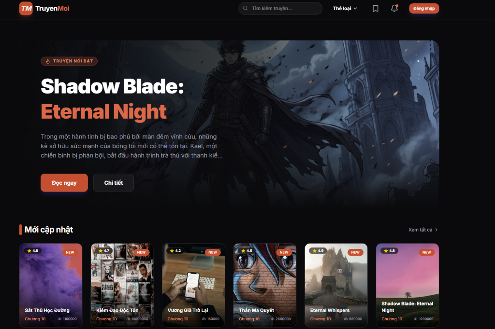
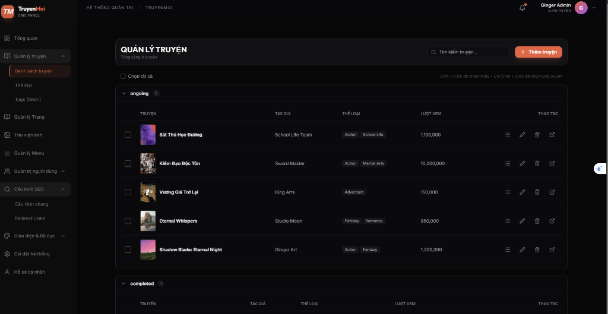

# 📚 Site Comics - Hệ Thống Đọc Truyện Tranh Trực Tuyến

> Nền tảng đọc truyện tranh full-stack hiện đại với quản lý nội dung mạnh mẽ, giao diện đẹp mắt và trải nghiệm người dùng tuyệt vời.


---

## 📋 Mục Lục

- [Giới Thiệu Dự Án](#-giới-thiệu-dự-án)
- [Kiến Trúc Hệ Thống](#-kiến-trúc-hệ-thống)
- [Các Thành Phần Chính](#-các-thành-phần-chính)
- [Công Nghệ Sử Dụng](#-công-nghệ-sử-dụng)
- [Yêu Cầu Hệ Thống](#-yêu-cầu-hệ-thống)
- [Hướng Dẫn Cài Đặt](#-hướng-dẫn-cài-đặt)
- [Hướng Dẫn Sử Dụng Chi Tiết](#-hướng-dẫn-sử-dụng-chi-tiết)
- [Tính Năng Nổi Bật](#-tính-năng-nổi-bật)
- [API Documentation](#-api-documentation)
- [Troubleshooting](#-troubleshooting)

---

## 🎯 Giới Thiệu Dự Án

**Site Comics** là một hệ thống quản lý và đọc truyện tranh trực tuyến hoàn chỉnh, được thiết kế để:

- 📖 **Người đọc**: Trải nghiệm đọc truyện mượt mà, tìm kiếm dễ dàng, theo dõi truyện yêu thích
- 👨‍💼 **Quản trị viên**: Quản lý nội dung truyện, chương, thể loại một cách trực quan và hiệu quả
- 🎨 **Tùy biến cao**: Header/Footer động, Menu builder, SEO optimization

### Tại sao chọn Site Comics?

✅ **Kiến trúc hiện đại**: Tách biệt Frontend, Backend và CMS để dễ bảo trì và mở rộng  
✅ **Performance cao**: SSR/SSG với Next.js, caching thông minh  
✅ **Bảo mật tốt**: JWT authentication, role-based access control  
✅ **SEO friendly**: Meta tags động, sitemap tự động  
✅ **Responsive**: Hoạt động mượt mà trên mọi thiết bị  

## 📸 Screenshots

### Frontend - Trang Chủ

*Giao diện trang chủ với hero banner, danh sách truyện mới cập nhật và thể loại phổ biến*

### CMS - Bảng Điều Khiển

*Giao diện quản trị với danh sách truyện, tìm kiếm, lọc và các thao tác quản lý*

---

## 🏗 Kiến Trúc Hệ Thống

```
┌─────────────────────────────────────────────────────────────┐
│                    NGƯỜI DÙNG                                │
└─────────────────────────────────────────────────────────────┘
                            │
        ┌───────────────────┼───────────────────┐
        │                   │                   │
        ▼                   ▼                   ▼
┌──────────────┐    ┌──────────────┐    ┌──────────────┐
│   FRONTEND   │    │     CMS      │    │   MOBILE     │
│  (Next.js)   │    │   (React)    │    │   (Future)   │
│  Port: 3000  │    │  Port: 5173  │    │              │
└──────────────┘    └──────────────┘    └──────────────┘
        │                   │                   │
        └───────────────────┼───────────────────┘
                            │
                            ▼
                    ┌──────────────┐
                    │   BACKEND    │
                    │   (NestJS)   │
                    │  Port: 3001  │
                    └──────────────┘
                            │
                ┌───────────┼───────────┐
                │           │           │
                ▼           ▼           ▼
        ┌──────────┐  ┌─────────┐  ┌─────────┐
        │ MongoDB  │  │  Redis  │  │  Files  │
        │ Database │  │  Cache  │  │ Storage │
        └──────────┘  └─────────┘  └─────────┘
```

---

## 🧩 Các Thành Phần Chính

### 1️⃣ Backend (NestJS API Server)

**Vai trò**: Xử lý logic nghiệp vụ, quản lý database, xác thực người dùng

**Chức năng chính**:
- 🔐 Authentication & Authorization (JWT, Role-based)
- 📚 CRUD operations cho Comics, Chapters, Categories, Tags
- 📁 File upload & management
- 🎨 Dynamic Layout (Header/Footer/Menu)
- ⚙️ System settings & SEO configuration
- 📊 Analytics & statistics

**Cấu trúc thư mục**:
```
backend/
├── src/
│   ├── auth/              # Xác thực & phân quyền
│   ├── comics/            # Quản lý truyện
│   ├── chapters/          # Quản lý chương
│   ├── categories/        # Quản lý thể loại
│   ├── tags/              # Quản lý tags
│   ├── users/             # Quản lý người dùng
│   ├── media/             # Upload & quản lý file
│   ├── menus/             # Menu builder
│   ├── layout/            # Header/Footer động
│   ├── settings/          # Cài đặt hệ thống
│   ├── prisma/            # Database client
│   └── common/            # Shared utilities
├── prisma/
│   └── schema.prisma      # Database schema
└── uploads/               # Thư mục lưu file upload
```

### 2️⃣ Frontend (Next.js Website)

**Vai trò**: Giao diện người dùng cuối, hiển thị truyện, tương tác

**Chức năng chính**:
- 🏠 Trang chủ với truyện nổi bật, mới cập nhật
- 📖 Trang đọc truyện với trải nghiệm mượt mà
- 🔍 Tìm kiếm & lọc truyện theo thể loại, tags
- 👤 Trang cá nhân, lịch sử đọc, bookmark
- 💬 Bình luận & đánh giá
- 🌙 Dark mode
- 📱 Responsive design

**Cấu trúc thư mục**:
```
frontend/
├── src/
│   ├── app/               # App Router (Next.js 14)
│   │   ├── page.tsx       # Trang chủ
│   │   ├── comics/        # Danh sách & chi tiết truyện
│   │   ├── read/          # Trang đọc truyện
│   │   └── user/          # Trang người dùng
│   ├── components/        # React components
│   │   ├── layout/        # Header, Footer, Sidebar
│   │   ├── comic/         # Comic card, list
│   │   └── ui/            # Button, Input, Modal...
│   └── lib/               # Utilities, API client
└── public/                # Static assets
```

### 3️⃣ CMS (React Admin Dashboard)

**Vai trò**: Bảng điều khiển quản trị nội dung

**Chức năng chính**:
- 📊 Dashboard với thống kê tổng quan
- 📚 Quản lý truyện & chương (CRUD)
- 🖼️ Thư viện ảnh với upload, tìm kiếm
- 🏷️ Quản lý thể loại & tags
- 🎨 Header/Footer Builder (Drag & Drop)
- 🧭 Menu Builder
- 👥 Quản lý người dùng & phân quyền
- ⚙️ Cài đặt SEO & hệ thống

**Cấu trúc thư mục**:
```
cms/
├── src/
│   ├── presentation/      # UI Layer
│   │   ├── pages/         # Các trang quản lý
│   │   │   ├── ComicsManager.tsx
│   │   │   ├── ChaptersManager.tsx
│   │   │   ├── MediaManager.tsx
│   │   │   ├── HeaderBuilder.tsx
│   │   │   └── MenuBuilder.tsx
│   │   └── components/    # Reusable components
│   ├── infrastructure/    # API Services
│   │   └── api.service.ts
│   └── core/              # Business logic
│       └── interfaces.ts
└── public/                # Static assets
```

---

## 🛠 Công Nghệ Sử Dụng

### Backend Stack
| Công nghệ | Phiên bản | Mục đích |
|-----------|-----------|----------|
| **NestJS** | ^11.0.1 | Framework chính |
| **Prisma** | ^6.2.1 | ORM cho MongoDB |
| **MongoDB** | ^6.0 | Database |
| **Passport.js** | ^0.7.0 | Authentication |
| **JWT** | ^11.0.2 | Token-based auth |
| **Multer** | Built-in | File upload |
| **Helmet** | ^8.1.0 | Security headers |
| **Class Validator** | ^0.14.3 | DTO validation |

### Frontend Stack
| Công nghệ | Phiên bản | Mục đích |
|-----------|-----------|----------|
| **Next.js** | 14.x | React framework |
| **React** | 18.x | UI library |
| **TypeScript** | 5.x | Type safety |
| **Tailwind CSS** | 3.x | Styling |
| **React Query** | Latest | Data fetching |
| **Zustand** | Latest | State management |
| **Lucide Icons** | Latest | Icons |

### CMS Stack
| Công nghệ | Phiên bản | Mục đích |
|-----------|-----------|----------|
| **React** | 18.x | UI library |
| **Vite** | 5.x | Build tool |
| **TypeScript** | 5.x | Type safety |
| **Tailwind CSS** | 3.x | Styling |
| **React Router** | 6.x | Routing |
| **@dnd-kit** | Latest | Drag & drop |
| **React Hot Toast** | Latest | Notifications |

---

## 💻 Yêu Cầu Hệ Thống

### Phần mềm bắt buộc

| Phần mềm | Phiên bản tối thiểu | Link tải |
|----------|---------------------|----------|
| **Node.js** | 18.0.0 | [nodejs.org](https://nodejs.org/) |
| **npm** | 9.0.0 | Đi kèm Node.js |
| **MongoDB** | 6.0 | [mongodb.com](https://www.mongodb.com/try/download/community) |
| **Git** | 2.x | [git-scm.com](https://git-scm.com/downloads) |

### Kiểm tra phiên bản

```bash
node --version    # Kết quả: v18.x.x hoặc cao hơn
npm --version     # Kết quả: 9.x.x hoặc cao hơn
mongo --version   # Kết quả: 6.x.x hoặc cao hơn
git --version     # Kết quả: 2.x.x hoặc cao hơn
```

### Cấu hình khuyến nghị

- **RAM**: Tối thiểu 4GB (khuyến nghị 8GB+)
- **Ổ cứng**: 5GB trống
- **CPU**: 2 cores trở lên

---

## 🚀 Hướng Dẫn Cài Đặt

### Bước 1: Clone Repository

```bash
git clone https://github.com/Kim-Thu/site-comics.git
cd site-comics
```

### Bước 2: Cài Đặt MongoDB

#### Windows:
1. Download [MongoDB Community Server](https://www.mongodb.com/try/download/community)
2. Chạy file cài đặt, chọn "Complete" installation
3. Tick "Install MongoDB as a Service"
4. MongoDB sẽ tự động chạy tại `mongodb://localhost:27017`

#### macOS (Homebrew):
```bash
brew tap mongodb/brew
brew install mongodb-community@6.0
brew services start mongodb-community@6.0
```

#### Linux (Ubuntu/Debian):
```bash
wget -qO - https://www.mongodb.org/static/pgp/server-6.0.asc | sudo apt-key add -
echo "deb [ arch=amd64,arm64 ] https://repo.mongodb.org/apt/ubuntu focal/mongodb-org/6.0 multiverse" | sudo tee /etc/apt/sources.list.d/mongodb-org-6.0.list
sudo apt-get update
sudo apt-get install -y mongodb-org
sudo systemctl start mongod
sudo systemctl enable mongod
```

**Kiểm tra MongoDB đã chạy:**
```bash
# Windows
net start MongoDB

# macOS/Linux
sudo systemctl status mongod
```

### Bước 3: Cấu Hình Backend

```bash
cd backend
npm install
```

**Tạo file `.env`** trong thư mục `backend/`:

```env
# Database Connection
DATABASE_URL="mongodb://127.0.0.1:27017/site-comics"

# JWT Configuration
JWT_SECRET="your-super-secret-jwt-key-change-this-in-production-12345"
JWT_EXPIRES_IN="7d"

# Server Configuration
PORT=3001
API_URL="http://localhost:3001"

# CORS Configuration
ALLOWED_ORIGINS="http://localhost:3000,http://localhost:3002,http://localhost:5173"

# Redis (Optional - for caching)
REDIS_HOST="localhost"
REDIS_PORT=6379

# Email Configuration (Optional)
MAIL_USER="your-email@gmail.com"
MAIL_PASSWORD="your-app-password"
MAIL_FROM="Site Comics <noreply@sitecomics.com>"

# Upload Configuration
MAX_FILE_SIZE=10485760  # 10MB in bytes
ALLOWED_FILE_TYPES="image/jpeg,image/png,image/webp"
```

**Khởi tạo Database:**

```bash
# Generate Prisma Client
npx prisma generate

# Push schema to database
npx prisma db push

# Seed initial data (optional)
npx prisma db seed
```

### Bước 4: Cấu Hình Frontend

```bash
cd ../frontend
npm install
```

**Tạo file `.env.local`** trong thư mục `frontend/`:

```env
# API Endpoint
NEXT_PUBLIC_API_URL=http://localhost:3001

# Site Configuration
NEXT_PUBLIC_SITE_NAME="Site Comics"
NEXT_PUBLIC_SITE_URL=http://localhost:3000

# Analytics (Optional)
NEXT_PUBLIC_GA_ID=your-google-analytics-id
```

### Bước 5: Cấu Hình CMS

```bash
cd ../cms
npm install
```

**Tạo file `.env`** trong thư mục `cms/`:

```env
# API Endpoint
VITE_API_URL=http://localhost:3001

# CMS Configuration
VITE_APP_NAME="Site Comics CMS"
```

### Bước 6: Khởi Động Hệ Thống

Mở **3 terminal riêng biệt**:

#### Terminal 1 - Backend (Port 3001):
```bash
cd backend
npm run start:dev
```

Kết quả thành công:
```
[Nest] 12345  - 01/30/2026, 9:00:00 PM     LOG [NestFactory] Starting Nest application...
[Nest] 12345  - 01/30/2026, 9:00:01 PM     LOG [InstanceLoader] AppModule dependencies initialized
[Nest] 12345  - 01/30/2026, 9:00:02 PM     LOG [NestApplication] Nest application successfully started
```

#### Terminal 2 - Frontend (Port 3000):
```bash
cd frontend
npm run dev
```

Kết quả thành công:
```
  ▲ Next.js 14.x.x
  - Local:        http://localhost:3000
  - Network:      http://192.168.x.x:3000

 ✓ Ready in 2.5s
```

#### Terminal 3 - CMS (Port 5173):
```bash
cd cms
npm run dev
```

Kết quả thành công:
```
  VITE v5.x.x  ready in 500 ms

  ➜  Local:   http://localhost:5173/
  ➜  Network: http://192.168.x.x:5173/
```

### Bước 7: Truy Cập Ứng Dụng

| Ứng dụng | URL | Mô tả |
|----------|-----|-------|
| **Frontend** | http://localhost:3000 | Website người dùng |
| **CMS** | http://localhost:5173 | Bảng điều khiển admin |
| **API** | http://localhost:3001 | Backend API |

---

## 📖 Hướng Dẫn Sử Dụng Chi Tiết

### 🔐 Đăng Nhập CMS

1. Truy cập http://localhost:5173
2. Sử dụng tài khoản mặc định:
   ```
   Email: admin@example.com
   Password: admin123
   ```
3. **⚠️ QUAN TRỌNG**: Đổi mật khẩu ngay sau lần đăng nhập đầu tiên!

---

### 📚 Quản Lý Truyện

#### ➕ Thêm Truyện Mới

**Bước 1**: Vào menu **"Quản lý Truyện"** → Click **"Thêm truyện"**

**Bước 2**: Điền thông tin cơ bản:

| Trường | Mô tả | Bắt buộc |
|--------|-------|----------|
| **Tên truyện** | Tiêu đề truyện | ✅ |
| **Tác giả** | Tên tác giả | ✅ |
| **Mô tả** | Tóm tắt nội dung | ✅ |
| **Trạng thái** | Đang tiến hành / Hoàn thành | ✅ |
| **Ảnh bìa** | Upload từ Thư viện ảnh | ✅ |

**Bước 3**: Chọn thể loại & tags:
- Click vào dropdown **"Thể loại"**
- Chọn 1 hoặc nhiều thể loại (Action, Romance, Fantasy...)
- Tương tự với **"Tags"** (#Harem, #Isekai...)

**Bước 4**: Click **"Lưu"**

#### ✏️ Chỉnh Sửa Truyện

1. Trong danh sách truyện, click icon **✏️ (Edit)**
2. Cập nhật thông tin cần thiết
3. Click **"Lưu thay đổi"**

#### 🗑️ Xóa Truyện

**Xóa đơn lẻ**:
1. Click icon **🗑️ (Delete)** bên cạnh truyện
2. Xác nhận xóa

**Xóa hàng loạt**:
1. Tick checkbox các truyện cần xóa
2. Click **"Xóa X truyện"** ở góc trên
3. Xác nhận

**Mẹo**: 
- Shift + Click để chọn nhiều truyện liên tiếp
- Ctrl/Cmd + Click để chọn từng truyện riêng lẻ

---

### 📖 Quản Lý Chương

#### ➕ Thêm Chương Mới

**Bước 1**: Trong danh sách truyện, click icon **📋 (Quản lý chương)**

**Bước 2**: Click **"Thêm chương"**

**Bước 3**: Nhập thông tin:
- **Số chương**: Ví dụ: 1, 2, 3...
- **Tiêu đề**: Ví dụ: "Chương 1: Khởi đầu"

**Bước 4**: Upload ảnh chương:
- Click **"Chọn ảnh"** hoặc kéo thả file vào
- Có thể upload nhiều ảnh cùng lúc
- Định dạng hỗ trợ: JPG, PNG, WEBP
- Kích thước tối đa: 10MB/ảnh

**Bước 5**: Sắp xếp thứ tự ảnh:
- Kéo thả ảnh để sắp xếp lại
- Ảnh đầu tiên = trang đầu tiên

**Bước 6**: Click **"Lưu"**

#### ✏️ Chỉnh Sửa Chương

1. Click vào chương cần sửa
2. Cập nhật tiêu đề hoặc thêm/xóa ảnh
3. Click **"Lưu thay đổi"**

---

### 🏷️ Quản Lý Thể Loại & Tags

#### Thể Loại (Categories)

**Thêm thể loại mới**:
1. Vào **"Quản lý Thể loại"**
2. Click **"Thêm thể loại"**
3. Nhập:
   - **Tên**: Ví dụ: "Action"
   - **Slug**: Tự động tạo từ tên (action)
   - **Thể loại cha** (optional): Để tạo thể loại con
4. Click **"Lưu"**

**Ví dụ cấu trúc thể loại**:
```
Action
├── Martial Arts
└── Superpowers
Romance
├── School Life
└── Drama
```

#### Tags (Nhãn)

**Thêm tag mới**:
1. Vào **"Tags (Nhãn)"**
2. Click **"Thêm Tag"**
3. Nhập tên tag (ví dụ: #Fantasy, #Isekai)
4. Slug tự động tạo
5. Click **"Lưu"**

---

### 🎨 Header Builder (Xây Dựng Header Động)

Header Builder cho phép bạn tùy chỉnh header website bằng cách kéo thả các block.

#### Các Block Có Sẵn

| Block | Mô tả | Cấu hình |
|-------|-------|----------|
| **Logo** | Logo website | Upload ảnh, link |
| **Menu** | Menu điều hướng | Chọn menu đã tạo |
| **Search** | Thanh tìm kiếm | Placeholder text |
| **User Menu** | Menu người dùng | Đăng nhập/Đăng ký |
| **Banner Slider** | Slider quảng cáo | Thêm slides với ảnh, tiêu đề, link |
| **HTML** | Tùy chỉnh HTML | Nhập code HTML |

#### Cách Sử Dụng

**Bước 1**: Vào **"Header Builder"**

**Bước 2**: Kéo block từ thanh bên trái vào 3 vùng:
- **Top Row**: Vùng trên cùng (thường để thông báo, hotline)
- **Center Row**: Vùng chính (logo, menu, search)
- **Bottom Row**: Vùng dưới (menu phụ, banner)

**Bước 3**: Click vào block để cấu hình:

**Ví dụ cấu hình Banner Slider**:
1. Click vào block "Banner Slider"
2. Click **"Thêm slide"**
3. Nhập:
   - **Tiêu đề**: "Truyện mới: Shadow Blade"
   - **Link**: "/comics/shadow-blade"
   - **Ảnh**: Click để chọn từ thư viện
4. Thêm nhiều slide nếu cần
5. Click **"Áp dụng"**

**Bước 4**: Click **"Lưu Header"** để áp dụng

**Mẹo**:
- Kéo block ra ngoài để xóa
- Sắp xếp lại bằng cách kéo thả
- Tick "Ẩn trên thiết bị di động" nếu cần

---

### 🧭 Menu Builder (Xây Dựng Menu)

#### Tạo Menu Mới

**Bước 1**: Vào **"Menu Builder"** → Click **"Tạo Menu mới"**

**Bước 2**: Nhập tên menu (ví dụ: "Main Menu", "Footer Menu")

**Bước 3**: Thêm menu items:

**Cách 1: Thêm thủ công**
1. Click **"Thêm item"**
2. Nhập:
   - **Label**: Tên hiển thị (ví dụ: "Trang chủ")
   - **URL**: Đường dẫn (ví dụ: "/")
   - **Icon** (optional): Chọn icon
3. Click **"Thêm"**

**Cách 2: Thêm từ danh sách có sẵn**
1. Chọn tab **"Thể loại"** hoặc **"Trang"**
2. Tick các item cần thêm
3. Click **"Thêm vào menu"**

**Bước 4**: Sắp xếp & tạo submenu:
- **Kéo thả** để sắp xếp thứ tự
- **Indent** (→) để tạo submenu
- **Outdent** (←) để đưa ra ngoài

**Ví dụ cấu trúc menu**:
```
Trang chủ
Thể loại
├── Action
├── Romance
└── Fantasy
Truyện mới
Xếp hạng
```

**Bước 5**: Click **"Lưu"**

---

### 🖼️ Thư Viện Ảnh (Media Manager)

#### Upload Ảnh

**Cách 1: Click nút Upload**
1. Click **"Tải lên"**
2. Chọn file từ máy tính
3. Đợi upload hoàn tất

**Cách 2: Kéo thả**
1. Kéo file ảnh từ máy tính
2. Thả vào vùng upload
3. Đợi upload hoàn tất

**Lưu ý**:
- Định dạng hỗ trợ: JPG, PNG, WEBP
- Kích thước tối đa: 10MB
- Có thể upload nhiều ảnh cùng lúc

#### Quản Lý Ảnh

**Xem chi tiết ảnh**:
1. Click vào ảnh
2. Panel bên phải hiển thị:
   - Preview ảnh
   - Tên file
   - Kích thước
   - Loại file
   - Người upload
   - Ngày upload

**Chỉnh sửa thông tin**:
1. Click vào ảnh
2. Nhập:
   - **Caption**: Tiêu đề ảnh
   - **Alt text**: Văn bản thay thế (quan trọng cho SEO)
3. Thông tin tự động lưu khi blur

**Sao chép URL**:
1. Click vào ảnh
2. Click **"Sao chép URL"**
3. Paste vào nơi cần dùng

**Xóa ảnh**:
- **Xóa đơn lẻ**: Click vào ảnh → **"Xóa vĩnh viễn"**
- **Xóa hàng loạt**: 
  1. Shift + Click để chọn nhiều
  2. Click **"Xóa X ảnh"**
  3. Xác nhận

---

### ⚙️ Cài Đặt Hệ Thống

#### SEO Settings

1. Vào **"Cấu hình SEO"**
2. Cấu hình:

| Trường | Mô tả | Ví dụ |
|--------|-------|-------|
| **Site Title** | Tiêu đề website | "Site Comics - Đọc Truyện Tranh Online" |
| **Meta Description** | Mô tả ngắn | "Đọc truyện tranh miễn phí, cập nhật nhanh nhất" |
| **Keywords** | Từ khóa SEO | "truyện tranh, manga, manhwa, comic" |
| **OG Image** | Ảnh chia sẻ social | Upload ảnh 1200x630px |
| **Twitter Card** | Loại card Twitter | Summary Large Image |

3. Click **"Lưu"**

#### General Settings

1. Vào **"Cài đặt chung"**
2. Cấu hình:
   - **Tên website**
   - **Logo** (upload ảnh)
   - **Favicon** (upload .ico hoặc .png)
   - **Email liên hệ**
   - **Số điện thoại**
   - **Địa chỉ**
   - **Social media links** (Facebook, Twitter, Instagram...)

3. Click **"Lưu thay đổi"**

---

### 👥 Quản Lý Người Dùng

#### Xem Danh Sách Người Dùng

1. Vào **"Quản lý Người dùng"**
2. Xem thông tin:
   - Tên, email
   - Vai trò (Admin, User, Moderator)
   - Trạng thái (Active, Banned)
   - Ngày đăng ký

#### Phân Quyền

1. Click icon **⚙️** bên cạnh người dùng
2. Chọn vai trò mới:
   - **Admin**: Toàn quyền
   - **Moderator**: Quản lý nội dung
   - **User**: Người dùng thường
3. Click **"Lưu"**

#### Khóa/Mở Khóa Tài Khoản

1. Click icon **🔒** để khóa
2. Click icon **🔓** để mở khóa

---

## 🎨 Tính Năng Nổi Bật

### Frontend (Website Người Dùng)

#### 🏠 Trang Chủ
- Hero banner với truyện nổi bật
- Danh sách truyện mới cập nhật
- Truyện xem nhiều nhất
- Thể loại phổ biến
- Dark mode toggle

#### 📖 Trang Đọc Truyện
- Đọc truyện mượt mà, không giật lag
- Chuyển chương dễ dàng (← →)
- Fullscreen mode
- Bookmark tự động vị trí đọc
- Bình luận theo chương

#### 🔍 Tìm Kiếm & Lọc
- Tìm kiếm theo tên, tác giả
- Lọc theo thể loại
- Lọc theo tags
- Sắp xếp (mới nhất, xem nhiều, đánh giá cao)
- Pagination

#### 👤 Trang Cá Nhân
- Lịch sử đọc
- Truyện đang theo dõi
- Truyện yêu thích
- Cài đặt tài khoản

### CMS (Admin Dashboard)

#### 📊 Dashboard
- Thống kê tổng quan:
  - Tổng số truyện
  - Tổng số chương
  - Tổng số người dùng
  - Lượt xem hôm nay
- Biểu đồ lượt xem theo thời gian
- Truyện mới nhất
- Người dùng mới

#### 📚 Quản Lý Truyện
- CRUD operations
- Upload ảnh bìa
- Quản lý thể loại & tags
- Trạng thái (Ongoing, Completed)
- Multi-select & bulk actions
- Tìm kiếm & lọc

#### 📖 Quản Lý Chương
- CRUD operations
- Upload nhiều ảnh cùng lúc
- Drag & drop để sắp xếp ảnh
- Preview chương

#### 🖼️ Thư Viện Ảnh
- Upload ảnh (drag & drop)
- Quản lý metadata (caption, alt)
- Tìm kiếm ảnh
- Multi-select
- Copy URL nhanh
- Nhóm theo tháng upload

#### 🎨 Header/Footer Builder
- Drag & drop interface
- 6+ block types
- Live preview
- Responsive settings
- Lưu & publish

#### 🧭 Menu Builder
- Tạo menu không giới hạn
- Drag & drop để sắp xếp
- Indent/Outdent cho submenu
- Thêm từ thể loại/trang có sẵn
- Icon support

### Backend (API)

#### 🔐 Authentication & Authorization
- JWT-based authentication
- Role-based access control (RBAC)
- Refresh token
- Password hashing (bcrypt)

#### 📁 File Upload
- Multer integration
- File type validation
- Size limit
- Auto-generate unique filename
- Serve static files

#### 🗄️ Database
- MongoDB với Prisma ORM
- Type-safe queries
- Migrations
- Seeding

#### 🛡️ Security
- Helmet (security headers)
- CORS configuration
- Rate limiting
- Input validation (class-validator)
- XSS protection

---

## 📚 API Documentation

### Base URL
```
http://localhost:3001
```

### Authentication

#### Register
```http
POST /auth/register
Content-Type: application/json

{
  "email": "user@example.com",
  "password": "password123",
  "name": "User Name"
}
```

**Response**:
```json
{
  "user": {
    "id": "user-id",
    "email": "user@example.com",
    "name": "User Name",
    "role": "USER"
  },
  "token": "jwt-token"
}
```

#### Login
```http
POST /auth/login
Content-Type: application/json

{
  "email": "user@example.com",
  "password": "password123"
}
```

**Response**:
```json
{
  "user": {
    "id": "user-id",
    "email": "user@example.com",
    "name": "User Name",
    "role": "USER"
  },
  "token": "jwt-token"
}
```

### Comics

#### Get All Comics
```http
GET /comics?page=1&limit=20&search=keyword&category=action
```

**Response**:
```json
[
  {
    "id": "comic-id",
    "title": "Shadow Blade: Eternal Night",
    "slug": "shadow-blade-eternal-night",
    "thumbnail": "http://localhost:3001/uploads/image.jpg",
    "author": "Ginger Art",
    "description": "Trong một thế giới bị bao phủ bởi bóng đêm...",
    "status": "ongoing",
    "rating": 4.8,
    "views": 1200000,
    "categories": [
      { "id": "cat-id", "name": "Action" }
    ],
    "tags": [],
    "chapters": [
      {
        "id": "chapter-id",
        "number": 10,
        "title": "Chương 10",
        "slug": "chapter-10"
      }
    ],
    "createdAt": "2026-01-28T03:21:42.434Z",
    "updatedAt": "2026-01-30T04:57:44.363Z"
  }
]
```

#### Get Comic by ID
```http
GET /comics/id/:id
```

#### Create Comic (Admin only)
```http
POST /comics
Authorization: Bearer {token}
Content-Type: application/json

{
  "title": "New Comic",
  "author": "Author Name",
  "description": "Description here",
  "thumbnail": "image-url",
  "status": "ongoing",
  "categoryIds": ["cat-id-1", "cat-id-2"],
  "tagIds": ["tag-id-1"]
}
```

#### Update Comic (Admin only)
```http
PATCH /comics/:id
Authorization: Bearer {token}
Content-Type: application/json

{
  "title": "Updated Title",
  "status": "completed"
}
```

#### Delete Comic (Admin only)
```http
DELETE /comics/:id
Authorization: Bearer {token}
```

### Chapters

#### Get Chapters by Comic ID
```http
GET /chapters/comic/:comicId
```

#### Create Chapter (Admin only)
```http
POST /chapters
Authorization: Bearer {token}
Content-Type: application/json

{
  "comicId": "comic-id",
  "number": 1,
  "title": "Chương 1",
  "images": [
    "http://localhost:3001/uploads/page1.jpg",
    "http://localhost:3001/uploads/page2.jpg"
  ]
}
```

### Media

#### Upload Image
```http
POST /media/upload
Authorization: Bearer {token}
Content-Type: multipart/form-data

file: [binary]
```

**Response**:
```json
{
  "id": "media-id",
  "url": "http://localhost:3001/uploads/1769765685319-726631160.jpeg",
  "filename": "1769765685319-726631160.jpeg",
  "mimeType": "image/jpeg",
  "size": 4065984,
  "createdAt": "2026-01-30T13:21:25.319Z"
}
```

#### Get Media List
```http
GET /media?page=1&limit=24&search=keyword
Authorization: Bearer {token}
```

### Categories

#### Get All Categories
```http
GET /categories
```

#### Create Category (Admin only)
```http
POST /categories
Authorization: Bearer {token}
Content-Type: application/json

{
  "name": "Action",
  "slug": "action",
  "parentId": null
}
```

### Tags

#### Get All Tags
```http
GET /tags
```

#### Create Tag (Admin only)
```http
POST /tags
Authorization: Bearer {token}
Content-Type: application/json

{
  "name": "Fantasy",
  "slug": "fantasy"
}
```

### Layout

#### Get Header Configuration
```http
GET /layout/header
```

**Response**:
```json
{
  "top": {
    "left": [],
    "center": [],
    "right": []
  },
  "center": {
    "left": [
      {
        "id": "block-1",
        "type": "logo",
        "title": "Logo",
        "settings": {
          "image": "logo-url",
          "link": "/"
        }
      }
    ],
    "center": [
      {
        "id": "block-2",
        "type": "menu",
        "title": "Main Menu",
        "settings": {
          "menuId": "menu-id"
        }
      }
    ],
    "right": [
      {
        "id": "block-3",
        "type": "search",
        "title": "Search"
      }
    ]
  },
  "bottom": {
    "left": [],
    "center": [],
    "right": []
  }
}
```

#### Update Header (Admin only)
```http
POST /layout/header
Authorization: Bearer {token}
Content-Type: application/json

{
  "top": { "left": [], "center": [], "right": [] },
  "center": { ... },
  "bottom": { "left": [], "center": [], "right": [] }
}
```

---

## 🔧 Troubleshooting

### 1. Lỗi Kết Nối MongoDB

**Triệu chứng**:
```
MongoServerError: connect ECONNREFUSED 127.0.0.1:27017
```

**Nguyên nhân**: MongoDB chưa chạy

**Giải pháp**:

**Windows**:
```bash
# Kiểm tra trạng thái
net start | findstr MongoDB

# Khởi động MongoDB
net start MongoDB
```

**macOS/Linux**:
```bash
# Kiểm tra trạng thái
sudo systemctl status mongod

# Khởi động MongoDB
sudo systemctl start mongod

# Đặt tự động chạy khi khởi động
sudo systemctl enable mongod
```

### 2. Lỗi Port Đã Được Sử Dụng

**Triệu chứng**:
```
Error: listen EADDRINUSE: address already in use :::3001
```

**Nguyên nhân**: Port đang được process khác sử dụng

**Giải pháp**:

**Windows**:
```bash
# Tìm process đang dùng port 3001
netstat -ano | findstr :3001

# Kill process (thay <PID> bằng số PID tìm được)
taskkill /PID <PID> /F
```

**macOS/Linux**:
```bash
# Tìm và kill process
lsof -ti:3001 | xargs kill -9
```

### 3. Lỗi Prisma Generate

**Triệu chứng**:
```
Error: @prisma/client did not initialize yet
```

**Giải pháp**:
```bash
cd backend
npx prisma generate
npm run start:dev
```

### 4. Lỗi CORS

**Triệu chứng**:
```
Access to fetch at 'http://localhost:3001' from origin 'http://localhost:5173' 
has been blocked by CORS policy
```

**Giải pháp**: Kiểm tra file `backend/.env`:
```env
ALLOWED_ORIGINS="http://localhost:3000,http://localhost:3002,http://localhost:5173"
```

Restart backend sau khi sửa.

### 5. Hình Ảnh Không Hiển Thị

**Triệu chứng**: Uploaded images return 404

**Nguyên nhân**: 
- Thư mục uploads không tồn tại
- Helmet blocking cross-origin resources

**Giải pháp**:

1. Tạo thư mục uploads:
```bash
cd backend
mkdir uploads
```

2. Kiểm tra cấu hình Helmet trong `backend/src/main.ts`:
```typescript
app.use(helmet({
  crossOriginResourcePolicy: { policy: "cross-origin" },
}));
```

3. Restart backend

### 6. Lỗi Build Production

#### Backend
```bash
cd backend
rm -rf dist node_modules
npm install
npm run build
npm run start:prod
```

#### Frontend
```bash
cd frontend
rm -rf .next node_modules
npm install
npm run build
npm start
```

#### CMS
```bash
cd cms
rm -rf dist node_modules
npm install
npm run build
npm run preview
```

### 7. Lỗi JWT Token Invalid

**Triệu chứng**:
```json
{
  "statusCode": 401,
  "message": "Unauthorized"
}
```

**Nguyên nhân**: Token hết hạn hoặc không hợp lệ

**Giải pháp**:
1. Đăng xuất và đăng nhập lại
2. Kiểm tra `JWT_SECRET` trong `.env` backend
3. Clear localStorage trong browser (F12 → Application → Local Storage → Clear)

### 8. Lỗi Upload File

**Triệu chứng**: Upload file thất bại

**Nguyên nhân**:
- File quá lớn (>10MB)
- Định dạng không hỗ trợ
- Thiếu quyền ghi thư mục uploads

**Giải pháp**:

1. Kiểm tra kích thước file (<10MB)
2. Chỉ upload JPG, PNG, WEBP
3. Cấp quyền ghi cho thư mục uploads:

**Windows**:
```bash
icacls backend\uploads /grant Users:F
```

**macOS/Linux**:
```bash
chmod 755 backend/uploads
```

---

## 🚀 Deploy Production

### Backend (NestJS)

**Sử dụng PM2**:
```bash
npm install -g pm2
cd backend
npm run build
pm2 start dist/main.js --name "site-comics-api"
pm2 save
pm2 startup
```

**Environment Variables**:
```env
NODE_ENV=production
DATABASE_URL="mongodb://your-production-db"
JWT_SECRET="your-production-secret"
API_URL="https://api.yoursite.com"
ALLOWED_ORIGINS="https://yoursite.com"
```

### Frontend (Next.js)

**Vercel** (Recommended):
1. Push code lên GitHub
2. Import project vào Vercel
3. Set environment variables
4. Deploy

**Manual**:
```bash
cd frontend
npm run build
npm start
```

### CMS (React)

**Build static files**:
```bash
cd cms
npm run build
```

Deploy thư mục `dist/` lên:
- Netlify
- Vercel
- AWS S3 + CloudFront
- Nginx

---

## 📝 License

This project is licensed under the MIT License.

## 👥 Authors

- **Kim Thu** - [GitHub](https://github.com/Kim-Thu)

## 🙏 Acknowledgments

- NestJS Team
- Next.js Team  
- React Team
- Prisma Team
- MongoDB Team

---

**⭐ Nếu project này hữu ích, đừng quên cho một star trên GitHub!**

**📧 Liên hệ**: Nếu có vấn đề, hãy tạo issue trên GitHub hoặc liên hệ qua email.
